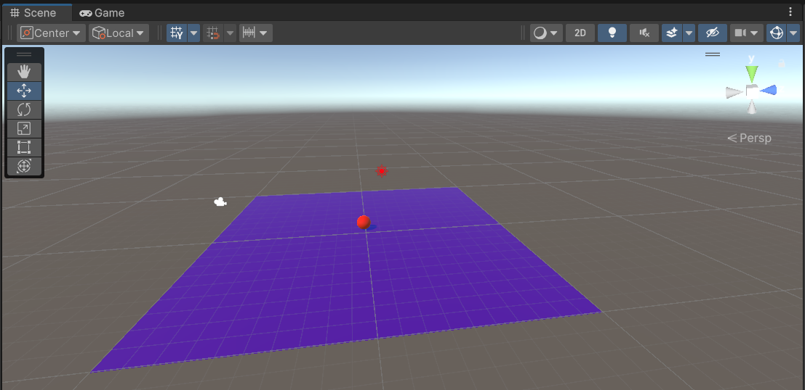
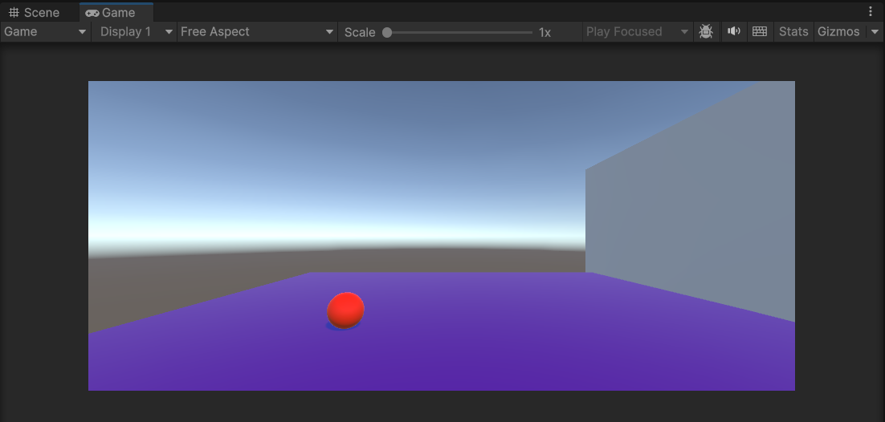

# <p align="center"> Roll a Ball</p>

## Aim:
To roll a ball using C# program in unity.

## Algorithm:

1. File -> Scene -> Select the scene -> Save as-> New folder(Scenes)-> File name (MiniGame)

2. Heirarchy -> 3D Object-> Plane 
[ Right side-> Inspector-> Change the name of plane (Name: Ground)
Transform -> Reset
Edit -> FrameSelected ]

3. Scale the ground by giving the scaling value as x=4 y=1 z=4

4. Heirarchy -> 3D Object-> Sphere
[ Right side-> Inspector-> Change the name of plane (Name: Player)
Transform -> Reset
Edit -> FrameSelected 
Transform -> Position -> y=0.5]

5. Hierarchy -> DirectionalLight
[ Inspector -> Change the color to white (255,255,255)]

6. Create a folder in project and name as Materials
[Material folder -> Create -> Material (Name: Background)
Inspector ->Surface Inputs ->BaseMAp (Choose the color)
Metallic map-> 0
Smoothness -> 0.25
Drag the Background to the plane and release the mouse

7. Material folder -> Create -> Material (Name: Sphere)
Inspector ->Surface Inputs ->BaseMAp (Choose the color)
Metallic map-> 0
Smoothness -> 0.75
Drag the Sphere material to the ball and release the mouse

8. Hierarchy -> Player-> Inspector ->Add component-> Rigidbody

9. Create a new script -> Create a folder in project (Name: Scripts)
Hierarchy -> Player -> Inspector-> AddComponent-> NewScripts-> PlayerController( Click create and Add)
Copy the PlayerController and drag to Script folder
Double click the PlayerController file and type the coding

## Program:
```
Developed By: Saravana Kumar S
Reg.No: 212221230088
```
```c#
using System.Collections;
using System.Collections.Generic;
using UnityEngine;
public class ball : MonoBehaviour 
{
    // Start is called before the first frame update
    float xForce = 5.0f;
    float zForce = 5.0f;
    float yForce = 20.0f;
    void Start()
    {
     
    }
    // Update is called once per frame
    void Update()
    {
        float x=0.0f,y=0.0f,z=0.0f;
        if (Input.GetKey(KeyCode.A))
        {
            x = x - xForce;
        }
        if (Input.GetKey(KeyCode.D))
        {
            x = x + xForce;
        }
        if (Input.GetKey(KeyCode.W))
        {
            z = z + zForce;
        }
        if (Input.GetKey(KeyCode.S))
        {
            z = z - zForce;
        }
        if (Input.GetKey(KeyCode.Space))
        {
            y = yForce;
        }
        GetComponent<Rigidbody>().AddForce(x, y, z);
    }
}
```
## Output:




## Result:
Thus, the 3D application for roll the ball objects in unity is developed successfully.